# Proyecto fase 1 - Sistemas de gestión de bases 2

## 1 hacer el entorno:

`python -m venv nombre_entorno`


### activarlo
    linux / mac:
    `source nombre_entorno/bin/activate`

### apagarlo:
`deactivate`


## 2 Ejecución de scripts

 requerimientos:

* selenium

        `pip install selenium`

* geckodriver

        macOS: `sudo port install geckodriver`
        Linux: `apt install firefox-geckodriver`

        verificar `geckodriver --version`

* Ejecutar descarga.py
    
    `python descarga.py`


## 3 ejecutar parsear los datos
        `python parse.py`

esto hará un archivo .csv con los datos recolectados


---

## 4 Descarga de Mundiales

Cada mundial se descarga individualmente. Firefox se abrirá automáticamente — no lo cierres mientras corre.

> ⚠️ Cada página espera **40-60 segundos** para no ser baneado. Un mundial tarda aprox. **10-15 minutos**.

```bash
python 1_mundiales.py 2022
```
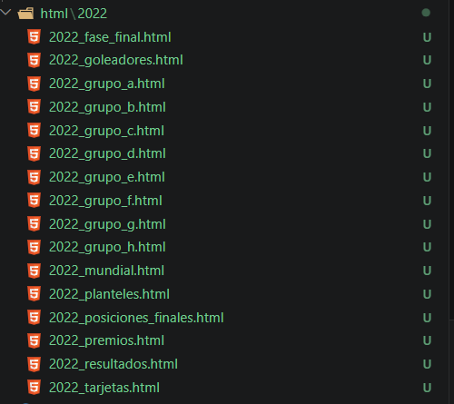

```bash
python 1_mundiales.py 2018
```
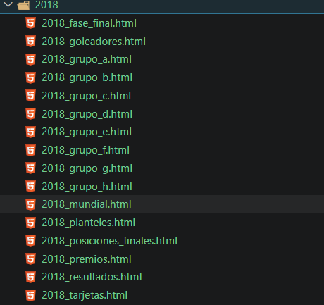

```bash
python 1_mundiales.py 2014
```
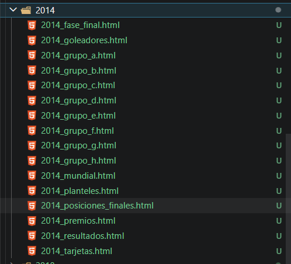

```bash
python 1_mundiales.py 2010
```
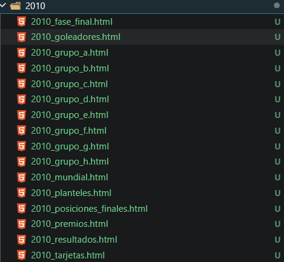

```bash
python 1_mundiales.py 2006
```
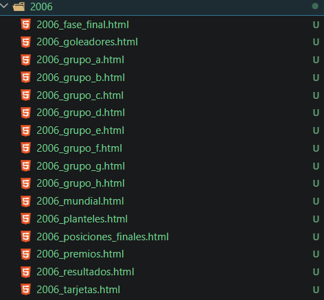

```bash
python 1_mundiales.py 2002
```
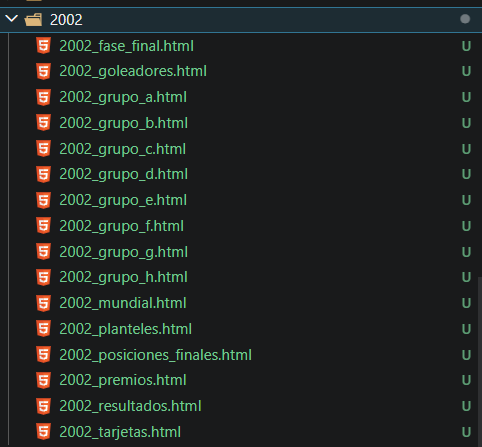

```bash
python 1_mundiales.py 1998
```
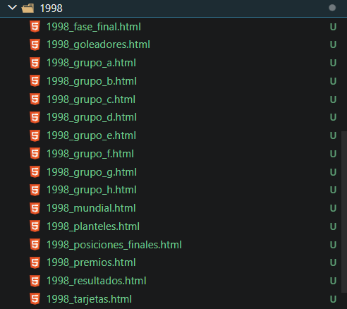

```bash
python 1_mundiales.py 1994
```
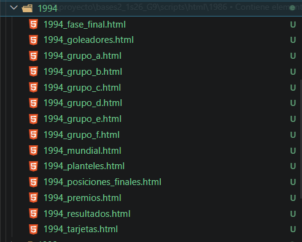

```bash
python 1_mundiales.py 1990
```
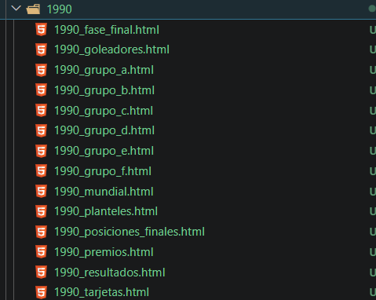

```bash
python 1_mundiales.py 1986
```
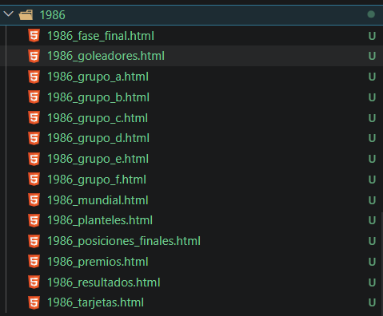

```bash
python 1_mundiales.py 1982
```
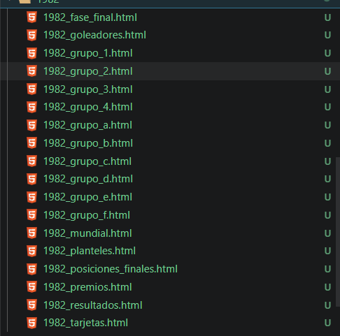

Los HTMLs quedan en:

```
html/
├── 2022/
├── 2018/
├── 2014/
├── 2010/
├── 2006/
├── 2002/
├── 1998/
├── 1994/
├── 1990/
├── 1986/
└── 1982/
```

---

## 5 Parsear datos de mundiales

### Parsear todos los años de una vez

```bash
python parser2.py
```

### Parsear por año

```bash
python parser2.py 2022
```
](images/data/2022/2022csv.png)

```bash
python parser2.py 2018
```
](images/data/2018/2018csv.png)

```bash
python parser2.py 2014
```
](images/data/2014/2014.png)

```bash
python parser2.py 2010
```
](images/data/2010/2010.png)

```bash
python parser2.py 2006
```
](images/data/2006/2006.png)

```bash
python parser2.py 2002
```
](images/data/2002/2002.png)

```bash
python parser2.py 1998
```
](images/data/1998/1998.png)

```bash
python parser2.py 1994
```
](images/data/1994/1994.png)

```bash
python parser2.py 1990
```
](images/data/1990/1990.png)

```bash
python parser2.py 1986
```
](images/data/1986/1086.png)

```bash
python parser2.py 1982
```
](images/data/1982/1982.png)

### CSVs generados en `data/`

| Archivo | Contenido |
|---|---|
| `mundiales.csv` | Organizador, campeón, # partidos, # goles, promedio |
| `partidos.csv` | Todos los partidos con fecha, etapa, marcador, TE, penales |
| `grupos.csv` | Grupos y sus selecciones |
| `posiciones_grupo.csv` | PTS, PJ, PG, PE, PP, GF, GC, Diferencia, Clasificado |
| `goles_partido.csv` | Minuto, jugador, equipo, si fue penal |
| `goleadores.csv` | Jugador, país, goles, partidos, promedio |
| `posiciones_finales.csv` | Clasificación final |
| `premios.csv` | Balón de Oro, Botín, Guante, etc. |
| `equipo_ideal.csv` | Jugadores del equipo ideal por posición |
| `tarjetas.csv` | Amarillas y rojas por jugador |
| `jugadores_pais.csv` | Jugadores por selección |

