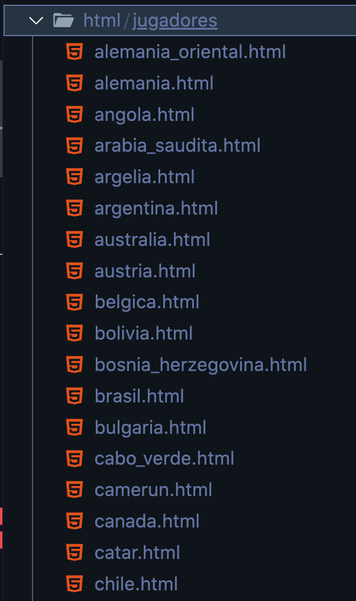
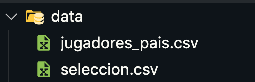

# Proyecto fase 1 - Sistemas de gestión de bases 2

## 1 hacer el entorno:

`python -m venv nombre_entorno`

### activarlo
    linux / mac:
    `source nombre_entorno/bin/activate`

### apagarlo:
`deactivate`

## 2 Ejecución de scripts

 requerimientos:

* selenium

        `pip install selenium`

* geckodriver

        macOS: `sudo port install geckodriver`
        Linux: `apt install firefox-geckodriver`

        verificar `geckodriver --version`

* Ejecutar descarga.py
    
    `python descarga.py`

## 3 ejecutar parsear los datos
        `python parse.py`

esto hará un archivo .csv con los datos recolectados

